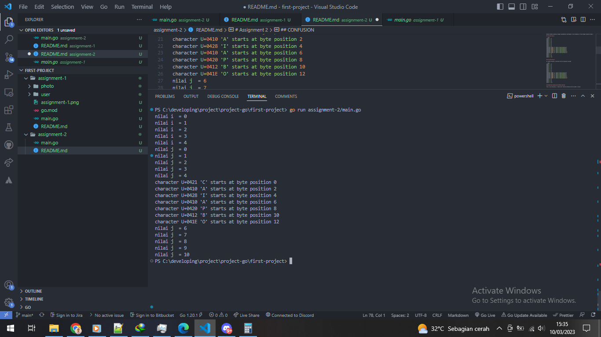

# Assignment 2

## Question

Buatlah sebuah program go dengan implementasi perulangan for dan kombinasi if-else dengan expected output :

## Expected Result

```bash
nilai i  = 0
nilai i  = 1
nilai i  = 2
nilai i  = 3
nilai i  = 4
nilai j  = 0
nilai j  = 1
nilai j  = 2
nilai j  = 3
nilai j  = 4
character U+0421 'C' starts at byte position 0
character U+0410 'A' starts at byte position 2
character U+0428 'I' starts at byte position 4
character U+0410 'A' starts at byte position 6
character U+0420 'P' starts at byte position 8
character U+0412 'B' starts at byte position 10
character U+041E 'O' starts at byte position 12
nilai j  = 6
nilai j  = 7
nilai j  = 8
nilai j  = 9
nilai j  = 10
```

## My System Result

my system unicode is different with the question unicode

```bash
nilai i  = 0
nilai i  = 1
nilai i  = 2
nilai i  = 3
nilai i  = 4
nilai j  = 0
nilai j  = 1
nilai j  = 2
nilai j  = 3
nilai j  = 4
character U+0043 'C' starts at byte position 0
character U+0041 'A' starts at byte position 2
character U+0049 'I' starts at byte position 4
character U+0041 'A' starts at byte position 6
character U+0050 'P' starts at byte position 8
character U+0042 'B' starts at byte position 10
character U+004F 'O' starts at byte position 12
nilai j  = 6
nilai j  = 7
nilai j  = 8
nilai j  = 9
nilai j  = 10
```

### MODIFYING UNICODE WITH MAPPED ADDITION

This is my conclusion, I really don't have any idea why this unicode is weird

- C => + 0x3DE
- A => + 0x3CF
- I => + 0x3DF
- P => + 0x3D0
- B => + 0x3D0
- O => + 0x3CF

## CONFUSION

- I really don't have any idea why this unicode is weird
- Why need to print the position if it's not really its' position (pos \* 2)

## Screenshot


