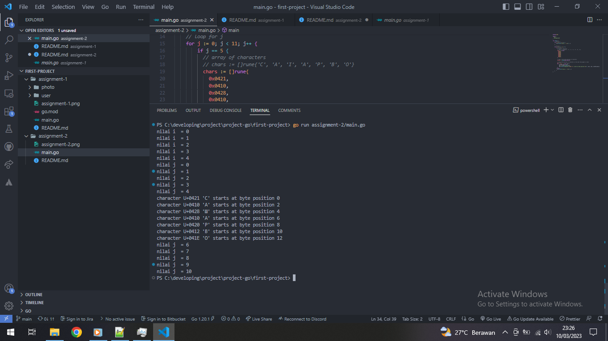

# Assignment 2

## Question

Buatlah sebuah program go dengan implementasi perulangan for dan kombinasi if-else dengan expected output :

## Expected Result

```bash
nilai i  = 0
nilai i  = 1
nilai i  = 2
nilai i  = 3
nilai i  = 4
nilai j  = 0
nilai j  = 1
nilai j  = 2
nilai j  = 3
nilai j  = 4
character U+0421 'C' starts at byte position 0
character U+0410 'A' starts at byte position 2
character U+0428 'I' starts at byte position 4
character U+0410 'A' starts at byte position 6
character U+0420 'P' starts at byte position 8
character U+0412 'B' starts at byte position 10
character U+041E 'O' starts at byte position 12
nilai j  = 6
nilai j  = 7
nilai j  = 8
nilai j  = 9
nilai j  = 10
```

## Screenshot


